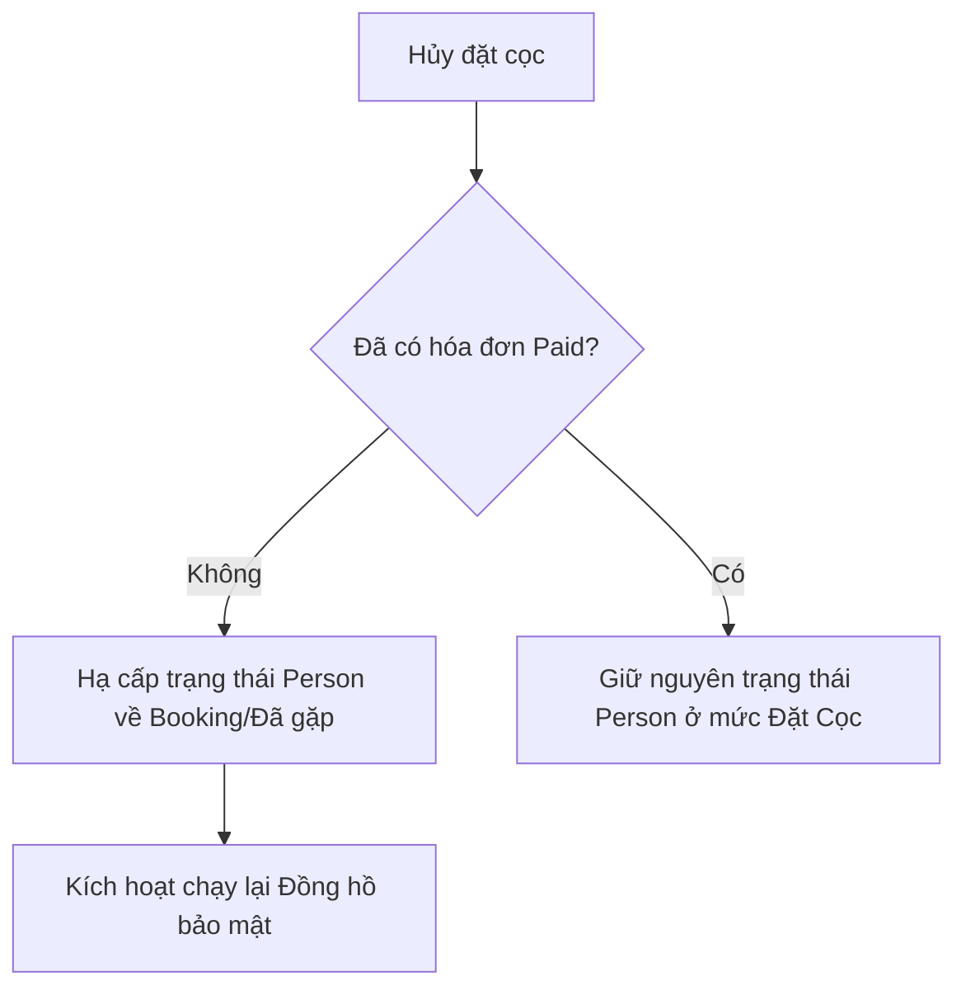

# Phân hệ 3: Quy tắc Nghiệp vụ Đặc thù (Core Business Rules)

Tài liệu này đặc tả chi tiết kỹ thuật các kịch bản kiểm thử, lưu đồ logic và các đoạn mã xử lý liên quan đến 4 quy tắc nghiệp vụ cốt lõi của IDEAS ERP.

---

## 🏗️ 1. Quy tắc hủy cọc (Deposit Cancellation Logic)

### 1.1. Lưu đồ & Chuỗi SQL kiểm thử



### Kịch bản 1.1: Hủy cọc khi CHƯA có doanh thu thực tế (Rule 1)
*   **Các lệnh SQL thực thi giả định**:
    1. Đặt cọc được tạo cho khách hàng `Person ID = 5001`.
    2. Xác nhận CSDL không có hóa đơn nào trạng thái `paid` liên kết với Person này:
        ```sql
        SELECT COUNT(*) FROM invoices WHERE contact_id = 5001 AND status = 'paid'; -- Kết quả: 0
        ```
    3. Thực hiện hủy cọc bằng cách cập nhật trạng thái phiếu cọc:
        ```sql
        UPDATE deposits SET status = 'cancelled' WHERE contact_id = 5001;
        ```
    4. Trình xử lý Backend (`DepositController.php`) tự động kiểm tra và hạ cấp trạng thái của khách hàng:
        ```sql
        UPDATE contacts SET stage = 'Booking', security_timer_active = 1, security_timer_start = NOW() WHERE id = 5001;
        ```
*   **Kết quả xác minh**: Truy vấn CSDL khách hàng phải hiển thị đúng trạng thái cũ và đồng hồ bảo mật được bật lại.

### Kịch bản 1.2: Hủy cọc sau khi đã phát sinh doanh thu (Rule 2)
*   **Các lệnh SQL thực thi giả định**:
    1. Ghi nhận hóa đơn đã thanh toán:
        ```sql
        INSERT INTO invoices (contact_id, amount, status) VALUES (5002, 10000000, 'paid');
        ```
    2. Gọi API hủy đặt cọc. Trình xử lý phát hiện hóa đơn `paid > 0` và bỏ qua bước hạ cấp trạng thái khách hàng.
*   **Kết quả xác minh**:
    ```sql
    SELECT stage FROM contacts WHERE id = 5002;
    -- Kết quả trả về phải là 'Đặt Cọc' (không bị hạ cấp).
    ```

---

## 🔄 2. Quy tắc đổi căn giao dịch (Unit Switching - Rule 3)
Khi khách hàng chuyển đổi giao dịch từ căn hộ A sang căn hộ B:
*   **Các bước xử lý SQL tuần tự**:
    1. Đóng deal cũ:
        ```sql
        UPDATE deals SET status = 'lost', loss_reason = 'Đổi sang căn B' WHERE id = 201;
        ```
    2. Tạo deal mới và liên kết lịch sử đối soát (`audit trail`):
        ```sql
        INSERT INTO deals (contact_id, unit_id, status, description) 
        VALUES (5003, 305, 'open', 'Đổi căn từ deal ID 201');
        
        INSERT INTO audit_logs (entity_type, entity_id, action, description) 
        VALUES ('deal', 202, 'SWITCH_UNIT', 'Đổi từ căn hộ ID 201 sang căn hộ ID 305');
        ```
*   **Kết quả xác minh**: Drawer chi tiết của Deal mới hiển thị rõ lịch sử liên kết đến Deal cũ để không bị thất thoát vết kiểm toán dòng tiền.

---

## 📡 3. Tín hiệu Conversion API Meta (CAPI - Rule 4)
*   **Mô tả**: Tín hiệu Conversion API gửi về Meta chỉ đi một chiều (Forward-only), không gửi tín hiệu hoàn trả khi deal bị bể.
*   **Cấu trúc payload CAPI gửi đi khi Deal thành công (Purchase)**:
    ```json
    {
      "event_name": "Purchase",
      "event_time": 1785166109,
      "user_data": {
        "em": "3b4f9... (hashed email)",
        "ph": "0988... (hashed phone)"
      },
      "custom_data": {
        "value": 15000000.00,
        "currency": "VND"
      }
    }
    ```
*   **Kịch bản kiểm thử**:
    1. Cập nhật trạng thái Deal sang `won` -> Xác minh webhook CAPI gửi payload thành công.
    2. Sau đó cập nhật Deal sang `lost` -> Xác minh trong nhật ký hàng đợi CAPI **không phát sinh** thêm bất kỳ sự kiện gửi nào khác liên quan đến mã khách hàng này.
